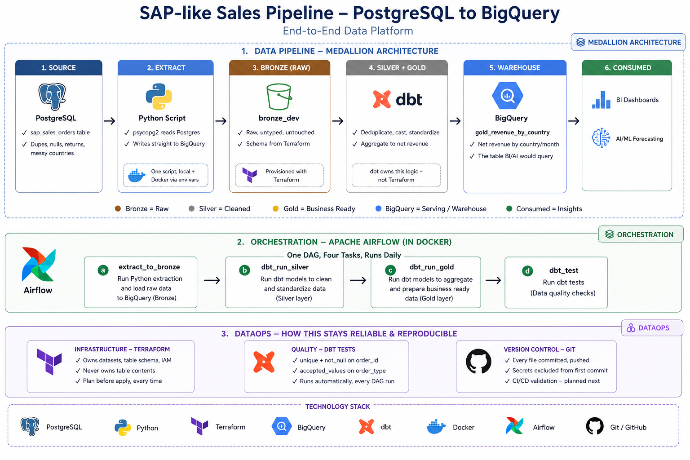

# SAP-like Sales Data Pipeline (PostgreSQL to BigQuery)

A real, working medallion-architecture data pipeline: SAP-like sales order
data, simulated in PostgreSQL with realistic data quality issues, flowing
through Google Cloud Platform via Terraform-provisioned infrastructure,
cleaned and aggregated with dbt, and fully orchestrated with Airflow
running in Docker.

Built end-to-end by hand, including every real problem hit along the way -
this README documents the actual process, not just the finished result.

## Architecture



PostgreSQL (messy source)
-> Python extraction script
-> BigQuery Bronze (raw, untouched)
-> dbt Silver (deduplicated, typed, standardized)
-> dbt Gold (business-ready aggregate)
-> orchestrated end-to-end by Airflow, running in Docker

**The ownership rule followed throughout**: Terraform provisions
infrastructure shape only (datasets, tables' schemas, service accounts) -
it never owns table contents or transformation logic. dbt owns all
transformation logic and tests. Airflow owns scheduling and sequencing.
Each tool does one job.

## Project folder structure

```text
sap-messy-data-project/
├── .env                          - DB_PASSWORD (not committed)
├── .gitignore
├── README.md
├── requirements.txt              - pinned Python packages for local venv
├── generate_sap_data.py          - creates messy PostgreSQL source data
├── extract_to_bronze.py          - PostgreSQL -> BigQuery Bronze
├── docker-compose.yml            - Postgres (Airflow metadata), webserver, scheduler
│
├── keys/
│   └── dbt_service_account.json  - GCP service account key (not committed)
│
├── schemas/
│   └── sales_orders_bronze.json  - Bronze table schema (used by Terraform)
│
├── terraform/
│   ├── main.tf                   - all GCP resources
│   ├── variables.tf              - project_id, region, environment
│   ├── outputs.tf                - dataset IDs, service account key (sensitive)
│   ├── terraform.tfvars.example
│   ├── terraform.tfvars          - your real project_id (not committed)
│   └── .terraform.lock.hcl       - provider version lock (committed)
│
├── dbt/
│   ├── dbt_project.yml
│   ├── profiles.yml              - BigQuery connection (not committed)
│   ├── models/
│   │   ├── sources.yml           - declares the Bronze table as a dbt source
│   │   ├── silver/
│   │   │   ├── silver_sales_orders.sql
│   │   │   └── schema.yml        - tests: unique, not_null, accepted_values
│   │   └── gold/
│   │       ├── gold_revenue_by_country.sql
│   │       └── schema.yml
│   └── macros/
│       └── generate_schema_name.sql  - makes +schema map to exact dataset name
│
└── airflow/
    ├── Dockerfile                 - Airflow + dbt-bigquery + psycopg2
    └── dags/
        └── sap_pipeline_dag.py     - extract -> dbt Silver -> dbt Gold -> dbt test
```
## The full process, in the order it was actually built

### 1. PostgreSQL - the messy source

Installed PostgreSQL + pgAdmin 4, created a database `sap_messy_data`, and
a single table:

```sql
CREATE TABLE sap_sales_orders (
    vbeln  VARCHAR(10),
    kunnr  VARCHAR(10),
    name1  VARCHAR(100),
    land1  VARCHAR(50),
    netwr  VARCHAR(20),   -- text on purpose, mirrors real SAP OData exports
    waerk  VARCHAR(5),
    erdat  VARCHAR(8)     -- raw YYYYMMDD string, not a DATE type
);
```

`generate_sap_data.py` then inserts ~300 rows with deliberate real-world
data quality problems: ~4% duplicate order numbers, inconsistent country
naming (`DE`/`Germany`/`Deutschland`), ~2% missing customer names, and ~6%
returns (negative amounts). Credentials read from a `.env` file via
`python-dotenv`, never hardcoded.

```bash
pip install psycopg2-binary python-dotenv
python generate_sap_data.py
```

### 2. GCP infrastructure - Terraform

Created a fresh GCP project, enabled billing (free trial, $300 credit),
authenticated:
```bash
gcloud auth login
gcloud auth application-default login
gcloud config set project sap-postgres-pipeline
```

`terraform/main.tf` provisions:
- Three BigQuery datasets: `bronze_dev`, `silver_dev`, `gold_dev`
- The `bronze_dev.sales_orders` table, schema defined in
  `schemas/sales_orders_bronze.json` (all STRING columns - untyped, exactly
  matching the raw Postgres source)
- A service account `sap-pipeline-dev` with only `bigquery.jobUser` and
  `bigquery.dataEditor` roles - least privilege, nothing broader
- A service account key, for local/Docker authentication

```bash
cd terraform
terraform init      # downloads the Google provider
terraform validate  # checks syntax
terraform plan      # shows what WILL change, before it happens
terraform apply     # actually creates the resources
```

Extracted the key into a usable file:
```powershell
$keysPath = Join-Path (Split-Path (Get-Location) -Parent) "keys\dbt_service_account.json"
$encoded = terraform output -raw pipeline_sa_key_base64
[System.IO.File]::WriteAllBytes($keysPath, [System.Convert]::FromBase64String($encoded))
```

**Real incident**: an earlier key was accidentally exposed by pasting the
full JSON file contents into a chat for debugging. Rotated immediately:
```bash
terraform taint google_service_account_key.pipeline_sa_key
terraform apply
```
Lesson: check secrets files by grepping a harmless field (`client_email`),
never paste the whole file, anywhere.

### 3. Extraction - PostgreSQL to BigQuery Bronze

`extract_to_bronze.py` connects to both systems and moves the raw data
across, untouched:
```bash
pip install google-cloud-bigquery
python extract_to_bronze.py
```
Uses `os.environ.get("PG_HOST", "localhost")` and
`os.environ.get("GOOGLE_APPLICATION_CREDENTIALS", "keys/dbt_service_account.json")`
so the exact same script works both run locally and later inside Docker,
just by changing environment variables, not the code itself.

### 4. Transformation - dbt

Installed inside a dedicated **Python 3.12 virtual environment** -
dbt-core does not yet support Python 3.14 (a `mashumaro`/`pydantic`
incompatibility, confirmed via dbt-labs/dbt-core#12098):
```bash
py -3.12 -m venv venv
venv\Scripts\activate
pip install dbt-bigquery
```

**Silver** (`models/silver/silver_sales_orders.sql`): deduplicates by
`vbeln`, casts `netwr` text to `NUMERIC`, parses `erdat`'s `YYYYMMDD`
string into a real `DATE` with `parse_date('%Y%m%d', erdat)`, standardizes
messy country values into ISO codes, fills blank names with `'Unknown'`,
flags negative amounts as `'return'`.

**Gold** (`models/gold/gold_revenue_by_country.sql`): aggregates Silver
into net revenue by country and month, with a sales/returns breakdown.

Both have dbt tests (`unique`, `not_null`, `accepted_values`):
```bash
dbt debug              # verifies the BigQuery connection
dbt run --select silver_sales_orders
dbt test --select silver_sales_orders
dbt run --select gold_revenue_by_country
dbt test --select gold_revenue_by_country
```

`macros/generate_schema_name.sql` overrides dbt's default BigQuery
dataset-naming behavior, so `+schema: silver_dev` in `dbt_project.yml`
maps to exactly `silver_dev`, not a combined/prefixed name.

### 5. Orchestration - Docker + Airflow

Airflow does not run reliably natively on Windows, so it runs inside
Docker (which itself runs on WSL2).

`airflow/Dockerfile` extends the official Airflow image
(`apache/airflow:2.9.3-python3.12` - Python 3.12 again, same dbt
compatibility reason) with `psycopg2-binary`, `python-dotenv`,
`google-cloud-bigquery`, and `dbt-bigquery` installed.

`docker-compose.yml` runs four services: a dedicated Postgres instance
(Airflow's own metadata database - unrelated to `sap_messy_data`), and
Airflow's `init`, `webserver`, and `scheduler`, all sharing environment
variables and volume-mounted access to `dbt/`, `keys/`, and the
extraction script.

`airflow/dags/sap_pipeline_dag.py` defines one DAG, four tasks in
sequence: `extract_to_bronze` -> `dbt_run_silver` -> `dbt_run_gold` ->
`dbt_test`, scheduled `@daily`.

```bash
docker compose build          # builds the custom Airflow image
docker compose up airflow-init  # runs DB migration, creates admin user
docker compose up -d           # starts everything in the background
```
Open http://localhost:8080 (`admin`/`admin`), unpause and trigger
`sap_postgres_to_bigquery_pipeline`.

**Real issues hit and fixed, in order:**
1. **`localhost` doesn't work from inside a container** - it refers to the
   container itself, not the Windows host running Postgres. Fixed with
   Docker Desktop's special hostname `host.docker.internal`, passed in via
   a `PG_HOST` environment variable (defaulting to `localhost` for local
   runs, so one script works in both environments).
2. **403 error fetching task logs** - Airflow's webserver and scheduler
   need a shared `AIRFLOW__WEBSERVER__SECRET_KEY` to authenticate internal
   requests to each other. Without it, each container generates its own
   random key and can't read the other's logs.
3. **`KeyError: 'sap_pipeline://macros/generate_schema_name.sql'`** - a
   stale `dbt/target/` cache (specifically `partial_parse.msgpack`) from
   earlier local dbt runs conflicted once that same folder was mounted
   into the container. Fixed by deleting `dbt/target/` entirely - it's
   fully regenerated on the next `dbt run`, nothing of value is lost.

## Setup - reproducing this from scratch

### Prerequisites
- PostgreSQL + pgAdmin
- Python 3.12 specifically (`py -3.12 -m venv venv`)
- A GCP project with billing enabled
- Terraform, authenticated via `gcloud auth application-default login`
- Docker Desktop (with WSL2 enabled)

### Steps
1. Create the Postgres database and table (see section 1 above)
2. `pip install -r requirements.txt` inside a Python 3.12 venv
3. Create `.env` with `DB_PASSWORD=...`
4. `python generate_sap_data.py`
5. `cd terraform && cp terraform.tfvars.example terraform.tfvars` (add your
   real `project_id`), then `terraform init && terraform apply`
6. Extract the service account key (see section 2 above)
7. `python extract_to_bronze.py` (optional - confirms the connection works
   before relying on Airflow to do it)
8. `cd dbt && cp profiles.yml.example profiles.yml` (add your project ID),
   then `dbt run && dbt test`
9. `docker compose build && docker compose up airflow-init && docker compose up -d`
10. Trigger the DAG at http://localhost:8080

### Cleaning up
```bash
docker compose down -v
cd terraform && terraform destroy
```

## What's next

- CI/CD: validating Terraform and dbt on every push via GitHub Actions
- Real SAP connection: once real server access details are available,
  swapping the extraction step for the actual connection method (OData,
  RFC, or JDBC), while the Terraform/dbt/Airflow skeleton stays unchangedcat README.md